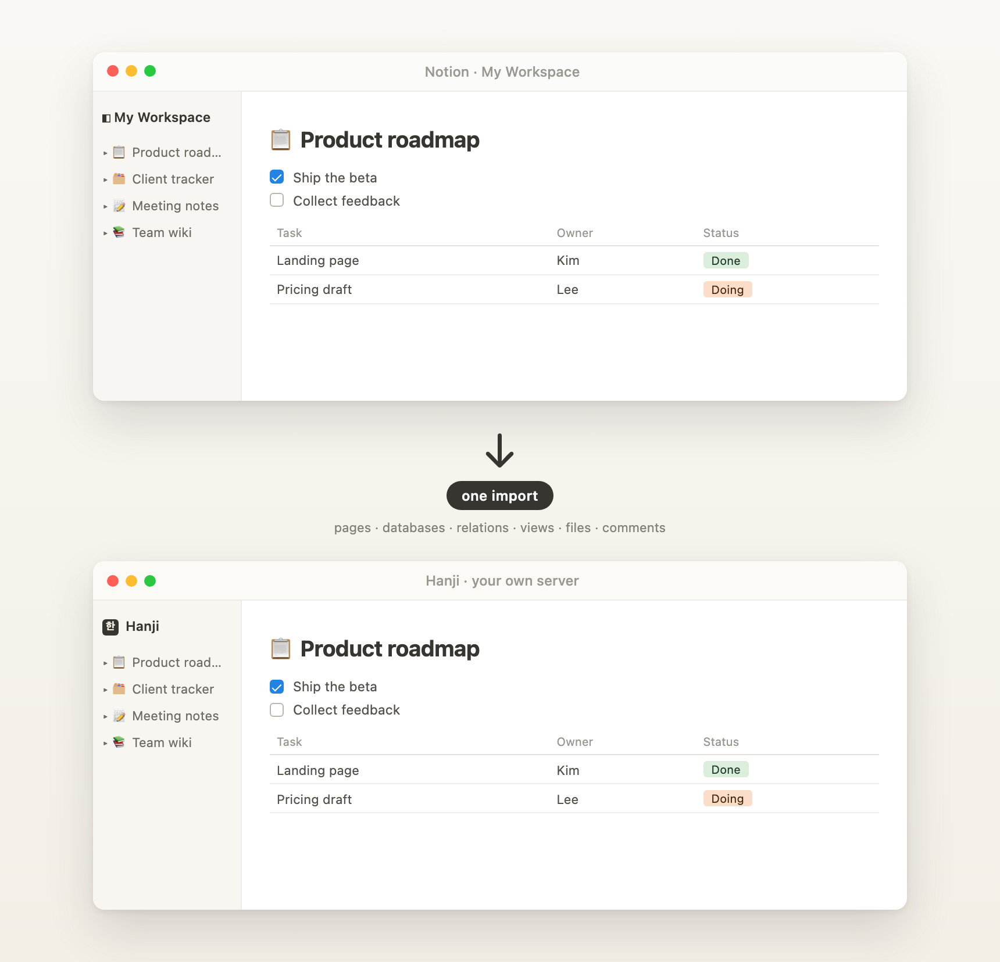
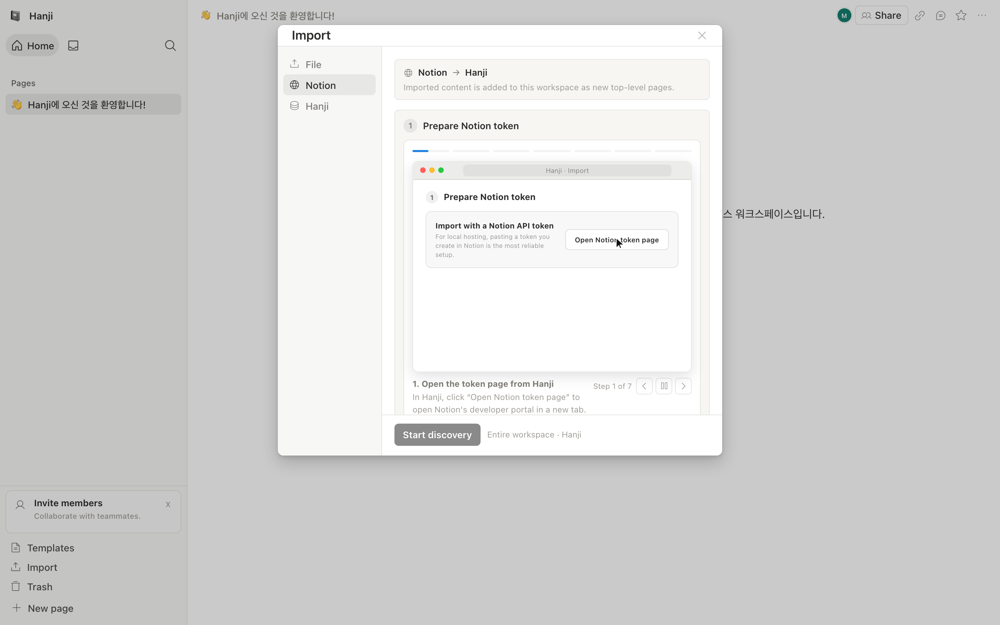
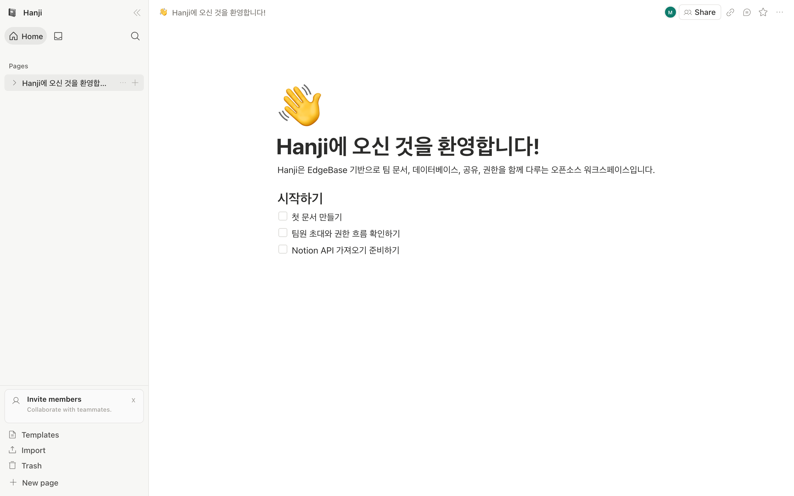

<p align="center">
  
</p>

<h1 align="center">Hanji</h1>

<p align="center"><i>Notion, on ground of your own.</i></p>

<p align="center"><b>An open-source Notion you host yourself</b> — real databases, real organization, an unrestricted MCP, and not a line of AI you didn't ask for.</p>

## Why I Built Hanji

Notion is a beautiful tool. I fell for it the first time I opened it, and I
never quite fell out. So this isn't a project born of frustration — it's one
born of wanting to keep the thing I loved, on ground of my own.

What I wanted was easy to say and hard to find: Notion I could run myself, in my
company's own Docker, my data resting on my own server. Every feature out in the
open with nothing held back behind an enterprise plan — SSO, SCIM, groups,
audit, and an MCP with no leash on it. And — only half in jest — a Notion where
pressing the spacebar doesn't summon an AI I never asked for. Notion is
SaaS-only and closed, keeps its admin features behind an Enterprise plan, and
weaves AI through the page whether you want it there or not. None of that is a
knock on Notion; it just wasn't the bargain I was after.

That last part isn't a quarrel with AI. I use it with Notion every day —
through MCP, from the outside — and I like it right there: a tool I reach for,
not a voice in every keystroke. So in Hanji I'd rather not thread AI through the
editor at all. I'd rather spend that care on the MCP itself, and let your own
agents move through the workspace on your terms. Here, AI isn't a built-in
feature — the doorway is.

I went looking through the open-source world first, and none of it quite fit.
The wikis — **Outline**, **Docmost** — are lovely, but they hold no real
databases. The local-first tools — **AppFlowy**, **AFFiNE**, **Anytype**,
**SiYuan** — have databases that thin out exactly where it matters, where
relations and rollups and formulas are meant to work as one, and their sense of
a team stays shallow. And more than once I met the same quiet letdown: open
source in name, but the piece I needed was waiting behind someone's paid cloud.
Worse, none of them could carry my Notion across whole — they read an *export*,
a flattened husk that leaves the databases, relations, and views behind, the
very things that made it a workspace at all.

So Hanji is my attempt to build the thing I couldn't find: Notion's shape
without the AI — real databases (relations, rollups, a formula engine, six
views, every row its own page), real organization, comments, sharing, search —
and a Notion-API import that brings your workspace over whole instead of in
pieces. All of it open, all of it yours to host, with an MCP wide enough for
your agents to do real work. That's the horizon I'm walking toward; some of it
stands today, and some is still going up ([see Status &
roadmap](#status--roadmap)).

And I have no wish to sell it back to you. It's open to the last line, and it
comes up on your own server with a single command — running it yourself was
always meant to be the easy road, not the hard one.

Notion is the tool I love. Hanji is my way of keeping it — on paper of my own,
in the open. I hope it becomes yours, too.

## Hanji vs Notion

The real yardstick is Notion itself. Hanji aims to match its non-AI feature set,
and deliberately differs on ownership.

| | Notion | Hanji |
| --- | --- | --- |
| Editor + databases (relations, rollups, formulas, 6 views) | full | aiming for parity (in progress) |
| Realtime collaboration, comments, sharing, search | full | building |
| Org admin — SSO, SCIM, groups, domains, audit | Enterprise plan (paid) | in the open source, no paywall (SSO/SCIM still hardening) |
| Bring an existing Notion workspace in | — it *is* Notion | Notion-API import (recursive) |
| **Self-host on your own server** | no — SaaS only | yes — local, Docker (Cloudflare in progress) |
| **Source** | proprietary | open source (AGPL) |
| **MCP for AI agents** | hosted / managed | unrestricted, self-hosted |
| **AI in the editor** | woven in | none — non-AI by design |
| **Where your data lives** | Notion's servers | your server |

> **Feature parity is the goal, not a finished claim.** Hanji is an active
> build; the *Hanji* column marks direction, not production-proven parity
> (notably SSO/SCIM are implemented but still being hardened). The *Notion*
> column describes the Notion product as of 2026 — verify specifics against
> Notion's own docs.

## Get started in 30 seconds

First, get the code:

```bash
git clone https://github.com/melodysdreamj/hanji && cd hanji
```

Then pick a mode and paste its block — no edits needed.

### Dev — the app at `http://localhost:8787`

Needs **Node.js ≥ 22.12** and **npm**.

```bash
npm --prefix backend install && npm --prefix web install && npm --prefix mcp install
HANJI_MASTER_EMAIL=admin@example.com HANJI_MASTER_PASSWORD='Hanji-Master-2026!' node scripts/setup-dev-env.mjs --yes
npm --prefix web run build && npm --prefix backend run dev
```

Open **http://localhost:8787** and sign in with **`admin@example.com`** /
**`Hanji-Master-2026!`** — dev-only example credentials; change them for anything
real. Editing the frontend? Also run `npm --prefix web run dev` for hot reload at
`http://localhost:3000`.

### Docker — self-host with HTTPS at `https://localhost:8443`

Needs **Docker** (daemon running). The source-build path creates the image,
issues a locally-trusted certificate, and prints the sign-in URL plus one-time
setup code:

```bash
bash scripts/selfhost-docker.sh up --build
```

Open the URL and choose the first administrator email/password in the browser.
Manage it with the `status`, `logs`, or `down` subcommand, for example
`bash scripts/selfhost-docker.sh status`. For a no-warning certificate, install
[mkcert](https://github.com/FiloSottile/mkcert) first. The release design also
supports pulling the same amd64/arm64 image from GHCR in Synology/NAS Container
Manager; the public image and multi-architecture manifest are not published
yet, so the pinned source build is the working path today.

### Cloudflare _(in progress)_ — deploy to your own Workers domain

Needs a Cloudflare account with Wrangler authenticated (`wrangler login` or a
`CLOUDFLARE_API_TOKEN`). Edit one file, then deploy:

```bash
cp backend/.env.release.example backend/.env.release   # fill in your domain, secrets, master account
npm --prefix backend run deploy                        # → your Workers domain
```

More — hot reload, local EdgeBase linking, email/OAuth/SSRF config, and
deployment: [docs/development.md](docs/development.md) ·
[docs/deployment.md](docs/deployment.md).

## Highlights

Built from scratch to feel like the real thing — pages and a block editor,
databases, sharing and comments, templates, search, trash, and organization
administration, the whole non-AI surface all the way down. It runs wherever you
put it (your laptop, your Docker, the Cloudflare edge) and ships with an **MCP
server**, so your AI agents can read and shape the workspace from the outside.

- **Notion import** — one import brings pages, databases, relations, views,
  files, and comments, with dry-run review, progress reporting, and
  imported-person mapping.
- **Block editor** — from-scratch editor with all core block types (text,
  headings, lists, to-dos, toggles, callouts, code, equations, tables, synced
  blocks, columns, media), slash menu, Markdown shortcuts, inline marks,
  drag/reorder, and undo/redo.
- **Databases** — table, board, list, gallery, calendar, and timeline views;
  filters, sorts, grouping; every property type from select to relation,
  rollup, and formula; every row opens as its own page; row templates.
- **Collaboration** — realtime presence, CRDT text merging, comments with
  mentions and resolve flows, notifications and an inbox, page-level and
  organization-level permissions, public web sharing, full-text search
  (CJK-aware).
- **Self-hosted auth** — email + password with TOTP MFA and recovery codes,
  server-level accounts (open signup or admin-only), admin-issued temporary
  passwords with forced change, and a master account provisioned from
  environment variables on first boot.
- **MCP server** — AI agents can list, search, create, and edit pages,
  databases, comments, files, and workspace/organization settings through
  the product API, with read-only and allowlist narrowing. See
  [`mcp/README.md`](mcp/README.md).
- **Responsive** — desktop sidebar and Notion-style mobile drawer UX.

## Screenshots

<p align="center">
  
</p>

<p align="center"><b>Notion &rarr; Hanji</b> — bring your whole Notion workspace to your own server in one import.</p>

<p align="center"><sub>The banner is drawn entirely by code (<code>scripts/readme-hero-banner.mjs</code>) — no Notion assets, generic UI only.</sub></p>

Real app captures, regenerated from the live product by
`scripts/readme-hero-capture.mjs`:

<p align="center">
  
</p>

<p align="center">
  
</p>

## Architecture

Three independent packages, each with its own `npm run dev`:

```
hanji/
├── backend/   EdgeBase BaaS — auth, database, storage, realtime (localhost:8787)
├── web/       Vite + React 19 static SPA front end (localhost:3000 in dev)
└── mcp/       Node stdio MCP server (talks to the backend's REST API)
```

The data model, auth/session security design, and SSRF guarding are described
in [docs/architecture.md](docs/architecture.md).

## Documentation

The authoritative documentation is available directly in [`docs/`](docs/).
The VitePress site is deployed to GitHub Pages after the public repository's
Pages workflow has completed; until then, use the in-repository links below.

| Doc | What it covers |
| --- | --- |
| [docs/development.md](docs/development.md) | Running locally, dev setup script, local EdgeBase linking, email/OAuth/passkey/SSRF configuration |
| [docs/architecture.md](docs/architecture.md) | Packages, data model, auth and session security |
| [docs/verification.md](docs/verification.md) | The full `verify:*` smoke/verification catalog (API, browser UI, import, MCP) |
| [docs/deployment.md](docs/deployment.md) | Docker / Cloudflare / portable pack deployment, master account env, deployment verification |
| [docs/master-account.md](docs/master-account.md) | How the first-admin master account is provisioned and rotated |
| [docs/sponsors.md](docs/sponsors.md) | The sign-in sponsor banner and how sponsor slots work |
| [docs/cloudflare-teardown.md](docs/cloudflare-teardown.md) | Removing every Cloudflare resource a deployment created |
| [mcp/README.md](mcp/README.md) | MCP tools and per-client setup guides |
| [CONTRIBUTING.md](CONTRIBUTING.md) | Development gates and pull request guidelines |

## Deploying

For a source-built self-hosted container,
[`scripts/selfhost-docker.sh up --build`](scripts/selfhost-docker.sh) is the
one-command path. [docs/deployment.md](docs/deployment.md) separates the
registry-image/NAS path from source/custom builds and covers HTTPS,
reverse-proxy, Cloudflare, and portable-pack deployment.

**Data & backups (Docker).** Everything you create lives in the `hanji-data`
Docker volume (mounted at `/data`) — pages, databases, uploaded files, and all.
Put it elsewhere with `--data /your/host/path` (an absolute path to bind-mount)
or `--data my-volume` (a named volume). For a full backup, keep that data **and**
the image-managed secrets stored inside `/data/.hanji/`; backing up the whole
volume/directory covers both. Legacy installs should start the new image once
with their old `.edgebase/docker/hanji.env` so its cryptographic values are
copied into `/data` before retiring that file. The TLS certificate volume can
regenerate on its own.

Docker normally creates its first administrator through the setup-code-protected
web installer. `HANJI_MASTER_EMAIL` / `HANJI_MASTER_PASSWORD` remain the
noninteractive path for Cloudflare, portable packs, and advanced Docker
automation. See [docs/deployment.md](docs/deployment.md).

## Status & roadmap

Hanji is an active beta, suitable for local evaluation and early self-hosted
adoption. The table distinguishes a tested core workflow from an area that is
still closing important parity or production-readiness gaps.

| Area | Status | On the horizon |
| --- | :---: | --- |
| Block editor — core blocks, slash menu, Markdown, marks, undo/redo | 🧪 Beta | edge-case editing and vertical-caret polish |
| Databases — table/board/list/gallery/calendar/timeline, relations, rollups, formulas | 🧪 Beta | deeper view behavior and large-workspace query scale |
| Notion-API import | 🧪 Beta | tighter relation/rollup/people fidelity and large-import scale |
| Comments, mentions, notifications & inbox | 🧪 Beta | broader notification kinds and grouping |
| Page & organization permissions, public web sharing | 🧪 Beta | remaining policy surfaces and denial-state UX |
| Full-text search (CJK-aware) | 🧪 Beta | ranking and keyboard edge cases |
| Self-hosted auth — password + TOTP MFA, recovery, server accounts | 🧪 Beta | delivered-mail and hosted-runtime verification |
| MCP server — scoped, product-API-backed | 🧪 Beta | hosted OAuth/runtime proof and broader production edge cases |
| Deploy — local dev & Docker | ✅ Available | production-hardening and upgrade/restore rehearsals |
| Deploy — Cloudflare Workers | 🚧 Hardening | first public hosted-runtime proof |
| Realtime collaboration — CRDT text merge, presence | 🧪 Beta | structural reconnect and production-grade selection mapping |
| SSO (SAML / OIDC) & SCIM provisioning | 🚧 Hardening | real-IdP verification |
| Native mobile apps | 🗺️ Planned | responsive web today |
| Data migration / versioning story | 🗺️ Planned | — |

<sub>✅ available = core workflow tested · 🧪 beta = usable with known gaps · 🚧 hardening = implemented but missing release evidence · 🗺️ planned = not built yet</sub>

> No area is labeled production-verified yet. That label is reserved until a
> hosted deployment passes the deployment, runtime, mail, backup/restore, and
> upgrade gates with production configuration.

## License

Hanji is funded by sponsors, not a paid tier: the people who help keep the
project going are shown on the sign-in screen. Leave that one piece in place
and, in practice, Hanji is yours — run it, modify it, keep your changes private,
even build on it commercially. That's the deal the license below encodes; the
exact, binding terms are in the linked files, not this summary.

[GNU AGPL-3.0](LICENSE), plus an optional [Sponsor Banner Exception
2.0](LICENSE-EXCEPTION): keep the sponsor feed and sign-in banner on by default,
and you also get royalty-free permission to keep changes private, run a hosted
service, combine Hanji with proprietary code, and redistribute without
Corresponding Source. Drop the banner and plain AGPL-3.0 applies; a commercial,
banner-free license may be available.

It's a non-standard instrument — read the [actual text](LICENSE-EXCEPTION) rather
than trusting this summary. Sponsor mechanics: [docs/sponsors.md](docs/sponsors.md).

## Trademark

Hanji is an independent project and is not affiliated with, endorsed by, or
sponsored by Notion Labs, Inc. “Notion” is a trademark of its respective owner
and is used here only to describe compatibility and migration. Hanji's
implementation is written from scratch and does not use Notion source code,
artwork, or proprietary product assets.
