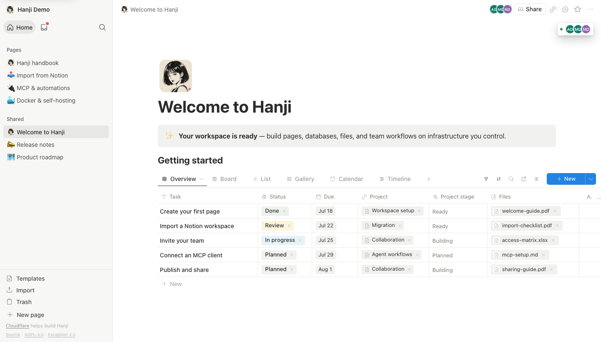
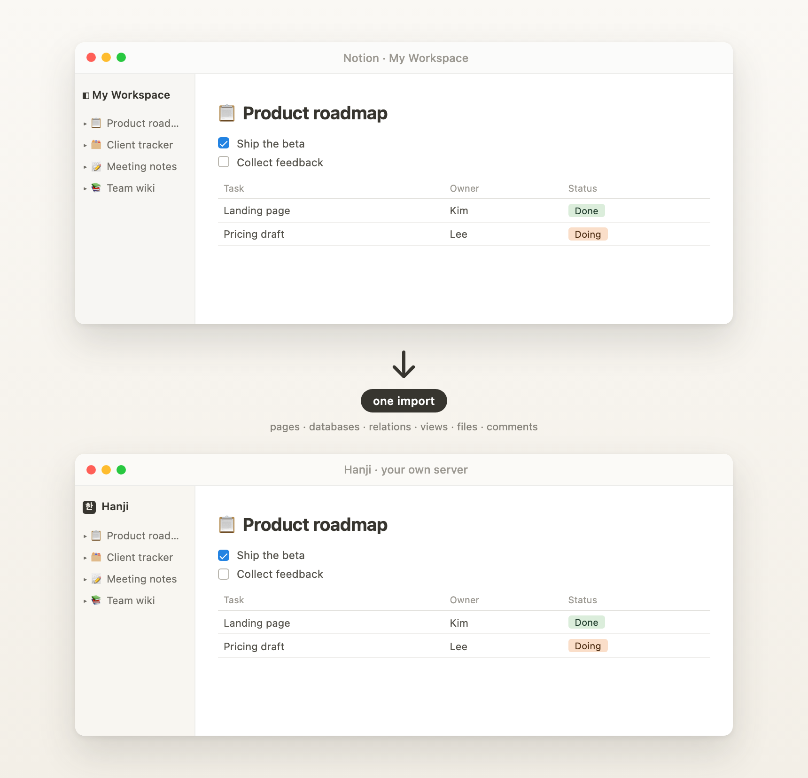
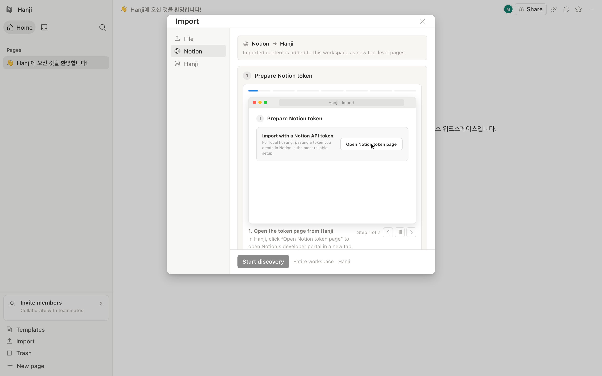
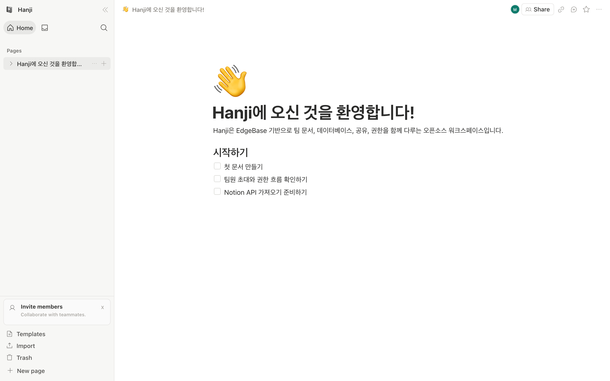

<p align="center">
  
</p>

<h1 align="center">Hanji</h1>

<p align="center"><i>Notion, on ground of your own.</i></p>

<p align="center"><b>An open-source Notion you host yourself</b> — real databases, real organization, and an unrestricted MCP.</p>

<p align="center">
  
</p>

## Why I Built Hanji

Notion is a beautiful tool. I fell for it the first time I opened it, and I
never quite fell out. So this isn't a project born of frustration — it's one
born of wanting to keep the thing I loved, on ground of my own.

What I wanted was easy to say and hard to find: Notion I could run myself, in my
company's own Docker, my data resting on my own server. Every feature out in the
open with nothing held back behind an enterprise plan — SSO, SCIM, groups,
audit, and an MCP with no leash on it. And — only half in jest — a Notion where
pressing the spacebar doesn't summon an AI I never asked for. Notion is
SaaS-only and closed, keeps its admin features behind an Enterprise plan, and
weaves AI through the page whether you want it there or not. None of that is a
knock on Notion; it just wasn't the bargain I was after.

That last part isn't a quarrel with AI. I use it with Notion every day —
through MCP, from the outside — and I like it right there: a tool I reach for,
not a voice in every keystroke. So in Hanji I'd rather not thread AI through the
editor at all. I'd rather spend that care on the MCP itself, and let your own
agents move through the workspace on your terms. Here, AI isn't a built-in
feature — the doorway is.

I went looking through the open-source world first, and none of it quite fit.
The wikis — **Outline**, **Docmost** — are lovely, but they hold no real
databases. The local-first tools — **AppFlowy**, **AFFiNE**, **Anytype**,
**SiYuan** — have databases that thin out exactly where it matters, where
relations and rollups and formulas are meant to work as one, and their sense of
a team stays shallow. And more than once I met the same quiet letdown: open
source in name, but the piece I needed was waiting behind someone's paid cloud.
Worse, none of them could carry my Notion across whole — they read an *export*,
a flattened husk that leaves the databases, relations, and views behind, the
very things that made it a workspace at all.

So Hanji is my attempt to build the thing I couldn't find: Notion's shape
without the AI — real databases (relations, rollups, a formula engine, six
views, every row its own page), real organization, comments, sharing, search —
and a Notion-API import that brings your workspace over whole instead of in
pieces. All of it open, all of it yours to host, with an MCP wide enough for
your agents to do real work. That's the horizon I'm walking toward; some of it
stands today, and some is still going up ([see Status &
roadmap](#status--roadmap)).

And I have no wish to sell it back to you. It's open to the last line, and it
comes up on your own server with a single command — running it yourself was
always meant to be the easy road, not the hard one.

Notion is the tool I love. Hanji is my way of keeping it — on paper of my own,
in the open. I hope it becomes yours, too.

## Hanji vs Notion

The real yardstick is Notion itself. Hanji aims to match its non-AI feature set,
and deliberately differs on ownership.

| | Notion | Hanji |
| --- | --- | --- |
| Editor + databases (relations, rollups, formulas, 6 views) | full | aiming for parity (in progress) |
| Realtime collaboration, comments, sharing, search | full | building |
| Org admin — SSO, SCIM, groups, domains, audit | Enterprise plan (paid) | in the open source, no paywall (SSO/SCIM still hardening) |
| Bring an existing Notion workspace in | — it *is* Notion | Notion-API import (recursive) |
| **Self-host on your own server** | no — SaaS only | yes — local, Docker (Cloudflare in progress) |
| **Source** | proprietary | open source (AGPL) |
| **MCP for AI agents** | hosted / managed | unrestricted, self-hosted |
| **AI in the editor** | woven in | none — non-AI by design |
| **Where your data lives** | Notion's servers | your server |

> **Feature parity is the goal, not a finished claim.** Hanji is an active
> build; the *Hanji* column marks direction, not production-proven parity
> (notably SSO/SCIM are implemented but still being hardened). The *Notion*
> column describes the Notion product as of 2026 — verify specifics against
> Notion's own docs.

## Quick start

### Docker — recommended

No source checkout, environment file, or terminal setup code is required.

#### Docker Hub / container UI

In a container UI that exposes per-container logging settings, pull
[`melodysdreamj/hanji:0.2.1-alpha`](https://hub.docker.com/r/melodysdreamj/hanji),
publish any unused host port to container `8787/TCP`, map durable storage to
`/data`, set the log driver to `local` with `max-size=10m` and `max-file=3`,
and set both memory and memory-plus-swap to the value printed by the image's
`hanji-memory-limit.mjs` helper before creating the container. Capable hosts use
the larger of 2 GiB or half of detected RAM (for example 2 GiB on a 4 GiB host
and 8 GiB on a 16 GiB host). Automatic sizing requires at least 4 GiB of host
RAM. If the UI cannot express those settings, use the command below.
Synology's normal container wizard does not
expose them, so the [Synology guide](docs/deployment.md#synology-container-manager)
uses a Container Manager Project/Compose configuration instead.

#### One command

```bash
HANJI_IMAGE=melodysdreamj/hanji:0.2.1-alpha
HANJI_MEMORY_LIMIT="$(
  docker run --rm --entrypoint node "$HANJI_IMAGE" \
    /usr/local/bin/hanji-memory-limit.mjs
)"
printf 'Hanji memory limit: %s\n' "$HANJI_MEMORY_LIMIT"
docker run -d \
  --name hanji \
  --restart unless-stopped \
  --log-driver local \
  --log-opt max-size=10m \
  --log-opt max-file=3 \
  --memory "$HANJI_MEMORY_LIMIT" \
  --memory-swap "$HANJI_MEMORY_LIMIT" \
  -p 127.0.0.1:8787:8787 \
  -v hanji-data:/data \
  "$HANJI_IMAGE"
```

The logging options keep `docker logs` available while rotating the
stdout/stderr stream instead of inheriting Docker's unbounded `json-file`
default. They apply when the container is created; recreate an older `hanji`
container to adopt them.
The equal finite memory limits let Hanji shed new work with retryable 429
responses before the container reaches its kernel OOM boundary. Operators may
set `HANJI_MEMORY_LIMIT=1536m` on the sizing-helper command to retain the
verified minimum tier, or choose another finite whole-MiB/GiB value; inspect
the printed result before creating the long-lived container.

> **Current release:** `0.2.1-alpha` is an early self-hosted beta. Back up
> `/data` before upgrading. The moving `alpha` tag is available, but `latest`
> is intentionally not published until the first stable release.

Open **http://localhost:8787** and choose the first administrator name, email,
and password in the browser.

Guides: [Docker Desktop & command line](docs/docker.md) ·
[Synology DSM](docs/deployment.md#synology-setup-wireframes)

### Cloudflare _(in progress)_ — deploy to your own Workers domain

Needs **Node.js ≥ 22.12**, **npm**, and a Cloudflare account with Wrangler
authenticated (`wrangler login` or a `CLOUDFLARE_API_TOKEN`):

```bash
git clone https://github.com/melodysdreamj/hanji && cd hanji
npm --prefix backend install && npm --prefix web install
cp backend/.env.release.example backend/.env.release   # fill in domain, secrets, mail, and legal URLs
npm --prefix backend run deploy                        # → deploy + private first-admin link
```

Leave `HANJI_MASTER_EMAIL` and `HANJI_MASTER_PASSWORD` empty. The deploy command
generates a private fragment-only setup link; open it and choose the first
administrator in the browser.

Cloudflare deployment is still being hardened; Docker is the recommended
self-hosted path today. See [docs/deployment.md](docs/deployment.md) for the
release environment, email, certificate, and teardown requirements.

## Development from source

Clone the repository when changing Hanji itself. For local hot reload:

```bash
git clone https://github.com/melodysdreamj/hanji && cd hanji
npm --prefix backend install && npm --prefix web install && npm --prefix mcp install
```

Create `backend/.env.development` and `backend/.dev.vars` with independent
development-only `JWT_USER_SECRET`, `JWT_ADMIN_SECRET`, and `SERVICE_KEY`
values, plus `HANJI_BROWSER_SETUP=true` and
`HANJI_WORKSPACE_DO_SPLIT=true`. Then run the backend and frontend in separate
terminals:

```bash
npm --prefix backend run dev        # backend API: http://localhost:8787
```

```bash
npm --prefix web run dev            # frontend hot reload: http://localhost:3000
```

The published multi-platform image is the supported Docker installation path.
Development details and deployment configuration live in
[docs/development.md](docs/development.md) and
[docs/deployment.md](docs/deployment.md).

## Highlights

Built from scratch to feel like the real thing — pages and a block editor,
databases, sharing and comments, templates, search, trash, and organization
administration, the whole non-AI surface all the way down. It runs wherever you
put it (your laptop, your Docker, the Cloudflare edge) and ships with an **MCP
server**, so your AI agents can read and shape the workspace from the outside.

- **Notion import** — one import brings pages, databases, relations, views,
  files, and comments, with dry-run review, progress reporting, and
  imported-person mapping.
- **Block editor** — from-scratch editor with all core block types (text,
  headings, lists, to-dos, toggles, callouts, code, equations, tables, synced
  blocks, columns, media), slash menu, Markdown shortcuts, inline marks,
  drag/reorder, and undo/redo.
- **Databases** — table, board, list, gallery, calendar, and timeline views;
  filters, sorts, grouping; every property type from select to relation,
  rollup, and formula; every row opens as its own page; row templates.
- **Collaboration** — realtime presence, CRDT text merging, comments with
  mentions and resolve flows, notifications and an inbox, page-level and
  organization-level permissions, public web sharing, full-text search
  (CJK-aware).
- **Self-hosted auth** — email + password with TOTP MFA and recovery codes,
  server-level accounts (open signup or admin-only), admin-issued temporary
  passwords with forced change, and browser first-run creation of the master
  account across dev, Docker, and Cloudflare.
- **MCP server** — AI agents can list, search, create, and edit pages,
  databases, comments, files, and workspace/organization settings through
  the product API, with read-only and allowlist narrowing plus per-workspace
  approved-client governance for hosted MCP. See
  [`mcp/README.md`](mcp/README.md).
- **Notion-compatible integration surfaces** — the checked-in compatibility
  inventory covers 48 REST operations and 20 MCP tools at `2026-03-11`, plus
  the current 13-operation Admin API at `2026-06-01`. MCP SQL streams one data
  source with bind-safe filters, projections, direct-property multi-key
  ordering, and opaque continuation without a Hanji plan gate or source-size
  ceiling.
- **Responsive** — desktop sidebar and Notion-style mobile drawer UX.

Compatibility is intentionally fail-closed rather than a claim to contain all
of SQLite or every Notion backend. MCP SQL forms that need cross-window state
(joins, CTEs/subqueries, DISTINCT, grouping/aggregates, unions, and computed
ordering), window functions, and a production PDF export renderer remain
unsupported. See the [MCP guide](mcp/README.md#notion-compatible-sql-queries)
and [Docker API guide](docs/docker.md#notion-compatible-api-and-hosted-mcp) for
the exact dialect, operation list, scopes, and resource budgets.

## Screenshots

<p align="center">
  
</p>

<p align="center"><b>Notion &rarr; Hanji</b> — bring your whole Notion workspace to your own server in one import.</p>

<p align="center"><sub>The banner and product captures use synthetic content only.</sub></p>

Additional app captures:

<p align="center">
  
</p>

<p align="center">
  
</p>

## Architecture

Three independent packages, each with its own `npm run dev`:

```
hanji/
├── backend/   EdgeBase BaaS — auth, database, storage, realtime (localhost:8787)
├── web/       Vite + React 19 static SPA front end (localhost:3000 in dev)
└── mcp/       Node stdio MCP server (talks to the backend's REST API)
```

The data model, auth/session security design, and SSRF guarding are described
in [docs/architecture.md](docs/architecture.md).

## Documentation

The authoritative documentation is available directly in [`docs/`](docs/).
The VitePress site is deployed to GitHub Pages after the public repository's
Pages workflow has completed; until then, use the in-repository links below.

| Doc | What it covers |
| --- | --- |
| [docs/docker.md](docs/docker.md) | Docker Hub, Docker Desktop/CLI, first administrator, `/data`, backup, updates, and HTTPS |
| [docs/development.md](docs/development.md) | Running locally, dev setup script, local EdgeBase linking, email/OAuth/passkey/SSRF configuration |
| [docs/architecture.md](docs/architecture.md) | Packages, data model, auth and session security |
| [docs/verification.md](docs/verification.md) | The full `verify:*` smoke/verification catalog (API, browser UI, import, MCP) |
| [docs/deployment.md](docs/deployment.md) | Docker / Cloudflare / portable pack deployment, browser first-run setup, deployment verification |
| [docs/master-account.md](docs/master-account.md) | How the first-admin master account is provisioned and rotated |
| [docs/sponsors.md](docs/sponsors.md) | The sign-in sponsor banner and how sponsor slots work |
| [docs/cloudflare-teardown.md](docs/cloudflare-teardown.md) | Removing every Cloudflare resource a deployment created |
| [mcp/README.md](mcp/README.md) | MCP tools and per-client setup guides |
| [CONTRIBUTING.md](CONTRIBUTING.md) | Development gates and pull request guidelines |

## Deploying

For normal self-hosting, use the immutable Docker Hub tag in
[Quick start](#quick-start). Publish a host port to container `8787/TCP`, keep
all persistent state in a named volume or dedicated folder mounted at `/data`,
and back up that whole volume before replacing or upgrading the container. The
first administrator is created in the browser without a terminal code or
required environment file.

The [Docker guide](docs/docker.md) covers Docker Desktop and command-line
installation, backups, updates, and rollback. The
[Synology visual guide](docs/deployment.md#synology-setup-wireframes) covers
volume and port mapping plus HTTPS reverse proxy setup. Source builds,
Cloudflare, portable packs, noninteractive administrator provisioning, and
advanced deployment settings remain in the full
[deployment guide](docs/deployment.md).

## Status & roadmap

Hanji is an active beta, suitable for local evaluation and early self-hosted
adoption. The table distinguishes a tested core workflow from an area that is
still closing important parity or production-readiness gaps.

| Area | Status | On the horizon |
| --- | :---: | --- |
| Block editor — core blocks, slash menu, Markdown, marks, undo/redo | 🧪 Beta | edge-case editing and vertical-caret polish |
| Databases — table/board/list/gallery/calendar/timeline, relations, rollups, formulas | 🧪 Beta | deeper view behavior and large-workspace query scale |
| Notion-API import | 🧪 Beta | tighter relation/rollup/people fidelity and large-import scale |
| Comments, mentions, notifications & inbox | 🧪 Beta | broader notification kinds and grouping |
| Page & organization permissions, public web sharing | 🧪 Beta | remaining policy surfaces and denial-state UX |
| Full-text search (CJK-aware) | 🧪 Beta | ranking and keyboard edge cases |
| Self-hosted auth — password + TOTP MFA, recovery, server accounts | 🧪 Beta | delivered-mail and hosted-runtime verification |
| MCP and Notion-compatible APIs — scoped, product-API-backed | 🧪 Beta | hosted runtime proof, PDF export rendering, and remaining bounded-SQL grammar |
| Deploy — local dev & Docker | ✅ Available | production-hardening and repeated multi-release upgrade/restore evidence |
| Deploy — Cloudflare Workers | 🚧 Hardening | first public hosted-runtime proof |
| Realtime collaboration — CRDT text merge, presence | 🧪 Beta | structural reconnect and production-grade selection mapping |
| SSO (SAML / OIDC) & SCIM provisioning | 🚧 Hardening | real-IdP verification |
| Native mobile apps | 🗺️ Planned | responsive web today |
| Data migration / versioning story | 🧪 Beta | destructive table migrations and longer multi-release history |

<sub>✅ available = core workflow tested · 🧪 beta = usable with known gaps · 🚧 hardening = implemented but missing release evidence · 🗺️ planned = not built yet</sub>

> No area is labeled production-verified yet. That label is reserved until a
> hosted deployment passes the deployment, runtime, mail, backup/restore, and
> upgrade gates with production configuration.

## License

Hanji is funded by sponsors, not a paid tier: the people who help keep the
project going are shown on the sign-in screen. Leave that one piece in place
and, in practice, Hanji is yours — run it, modify it, keep your changes private,
even build on it commercially. That's the deal the license below encodes; the
exact, binding terms are in the linked files, not this summary.

[GNU AGPL-3.0](LICENSE), plus an optional [Sponsor Banner Exception
2.0](LICENSE-EXCEPTION): keep the sponsor feed and sign-in banner on by default,
and you also get royalty-free permission to keep changes private, run a hosted
service, combine Hanji with proprietary code, and redistribute without
Corresponding Source. Drop the banner and plain AGPL-3.0 applies; a commercial,
banner-free license may be available.

It's a non-standard instrument — read the [actual text](LICENSE-EXCEPTION) rather
than trusting this summary. Sponsor mechanics: [docs/sponsors.md](docs/sponsors.md).

## Trademark

Hanji is an independent project and is not affiliated with, endorsed by, or
sponsored by Notion Labs, Inc. “Notion” is a trademark of its respective owner
and is used here only to describe compatibility and migration. Hanji's
implementation is written from scratch and does not use Notion source code,
artwork, or proprietary product assets.
