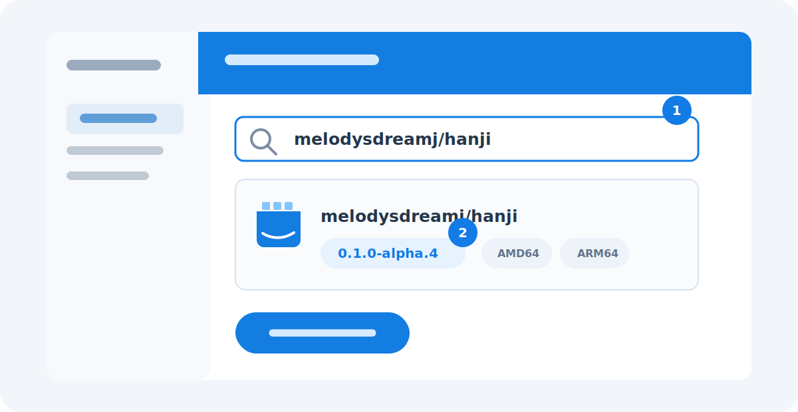
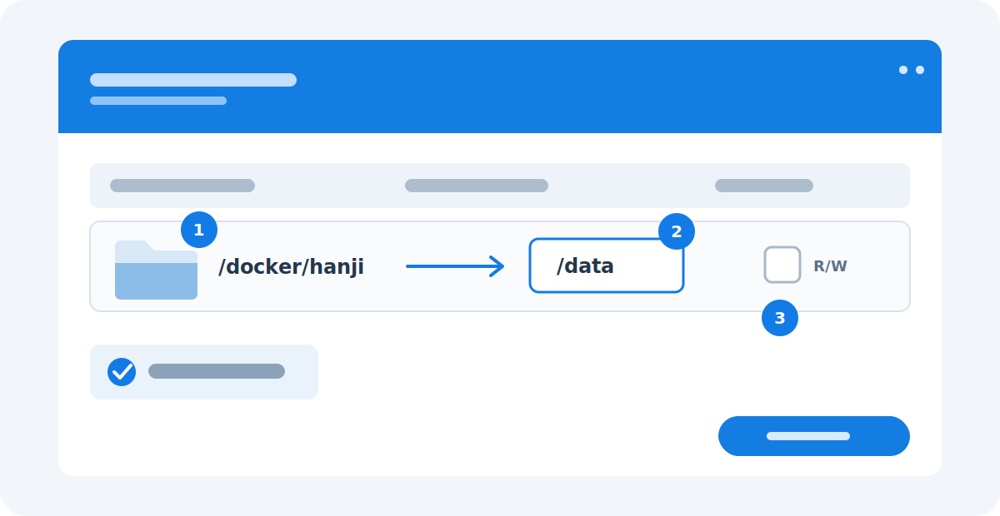
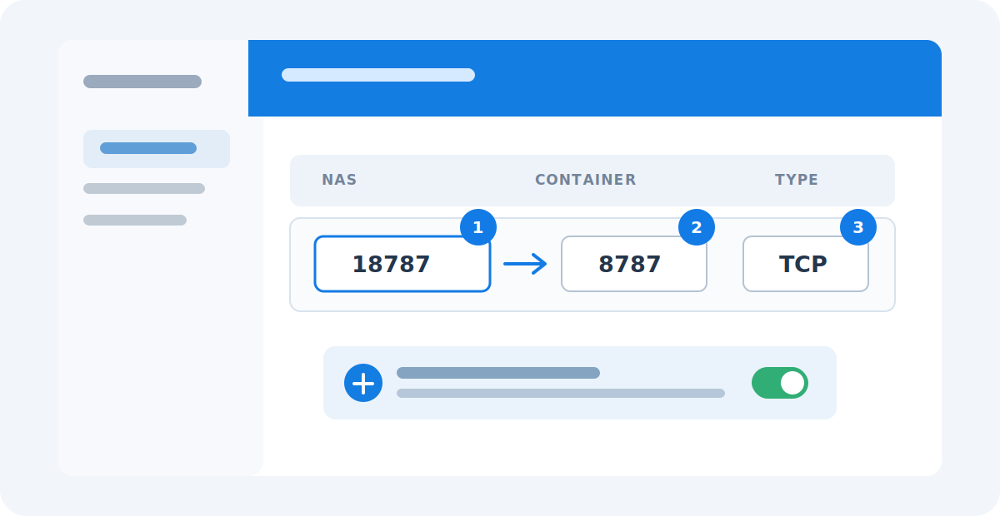
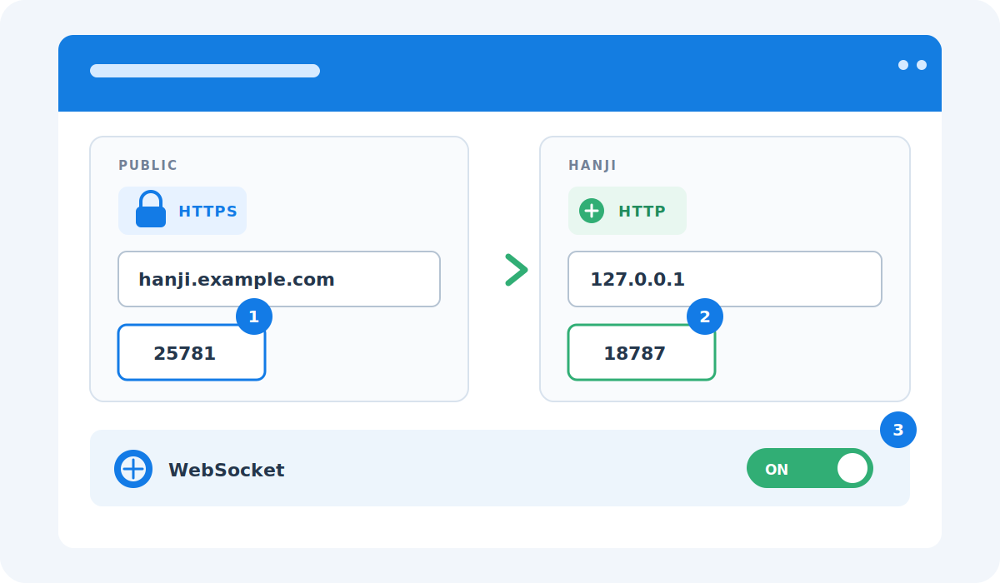

# Deployment

Hanji deploys as an EdgeBase app: the backend serves both the API and the
built SPA from one origin. Build the SPA first (`npm --prefix web run build`),
then use the EdgeBase deploy targets below.

## Two Docker installation paths

For the end-user Docker Desktop and command-line walkthrough, including
backups and updates, start with [Docker quick start](docker.md). The sections
below document the underlying deployment contract and advanced paths.

### Registry image (recommended for end users and NAS)

The release image is published to Docker Hub as `melodysdreamj/hanji` and to
GHCR as `ghcr.io/melodysdreamj/hanji`. The normal Docker/NAS install is:

```bash
docker run -d \
  --name hanji \
  --restart unless-stopped \
  -p 8787:8787 \
  melodysdreamj/hanji:0.1.0-alpha.4
```

Then open `http://localhost:8787` and create the first server administrator in
the browser. There is no certificate warning, terminal setup code, or required
environment file. The image declares port `8787` and a `/data` volume, so
Docker automatically creates an anonymous persistent volume even when no
volume is selected in Docker Desktop or Synology. Publishing a host port is
still required; use Docker Desktop's optional port setting or `-p` as above.

The anonymous volume survives container stop/start and restart, but its
generated name is harder to identify, back up, and intentionally reattach after
container replacement. For ongoing use, map a named volume with
`-v hanji-data:/data`, or map a dedicated host/NAS folder to container path
`/data` with read/write access. The image generates JWT, service,
import-encryption, and MCP OAuth secrets on first start and stores them under
`/data/.hanji/`; browser setup closes through durable database state rather
than a persisted terminal code.

**Publication status:** `0.1.0-alpha.4` is publicly pullable from Docker Hub and
GHCR as a multi-platform Linux AMD64/ARM64 image. Use the immutable version tag
for deployments; `alpha` follows the newest alpha, while `latest` is reserved
for a future stable release. Each new container release builds every platform
once, publishes the verified digests to both registries, and fails publication
if their anonymous manifests or final index digests differ.

### Source/custom build

Clone the repository and run:

```bash
bash scripts/selfhost-docker.sh up --build
```

This builds `hanji:latest` from the checked-out source, provisions HTTPS, starts
the same image contract, and prints the URL. Use this
path when changing Hanji, auditing the exact source, or testing an unreleased
revision. The repository build helper prepares the portable EdgeBase context
and adds Hanji's appliance entrypoint, so this path does not depend on an
unpublished local EdgeBase link. An existing legacy
`.edgebase/docker/hanji.env` remains supported;
the first start on the new image imports its cryptographic values into `/data`
before that env file is retired.

## First administrator on every runtime

Dev, Docker, and Cloudflare use the same browser form for the first server
administrator:

- **Dev**: `node scripts/setup-dev-env.mjs` writes runtime secrets only. Start
  the backend and enter the administrator name/email/password in the browser.
- **Docker**: open the fresh private instance and complete the form. No
  environment file or terminal setup code is required.
- **Cloudflare**: leave `HANJI_MASTER_EMAIL` and `HANJI_MASTER_PASSWORD` empty
  in `backend/.env.release`. `npm --prefix backend run deploy` generates a
  private `HANJI_BROWSER_SETUP_TOKEN`, syncs it as a Worker secret, and prints
  a fragment-only setup link after deploy. Open that link; an ordinary public
  visitor cannot claim the instance.
- **Portable pack**: enable `HANJI_BROWSER_SETUP=true` before the first start.
  Add a strong `HANJI_BROWSER_SETUP_TOKEN` when the runtime is already public.

The durable single-winner claim closes setup permanently. The old
`HANJI_MASTER_EMAIL` / `HANJI_MASTER_PASSWORD` pair remains supported only for
advanced noninteractive automation. Details:
[master-account.md](master-account.md).

## Ingress and HTTPS (Docker / pack)

### One source-build command

```bash
scripts/selfhost-docker.sh up
```

This builds the image, lets the image generate persistent secrets, issues an
HTTPS certificate (`mkcert`-trusted when available, otherwise self-signed),
runs the container over HTTPS, verifies that the persistence
volume has at least 512 MiB free, waits for both runtime and product-database
readiness, and then prints the URL. The browser creates
the master account. A failed capacity, readiness, or bootstrap check removes the
unhealthy container but keeps its data volume. Re-running reuses the same
runtime secrets, certificate, and `hanji-data` volume. The certificate's private key
stays mode `0600` in both the gitignored host state and the Docker-managed
`hanji-certs` volume; it is never made world-readable just to cross a host UID
boundary. Override with `--port N`,
`--email`, `--password`, or `--build` (force image rebuild). For a
proxy-terminated setup, use `--http --origin https://hanji.example.com`; this
binds the upstream to `127.0.0.1`, enables the explicit proxy-trust gate, and
uses the supplied public HTTPS origin. Manage the container with the `down`,
`logs`, and `status` subcommands. Advanced operators can change the free-space
floor with `HANJI_DOCKER_MIN_FREE_KB`. TLS helper state lives in the gitignored
`.edgebase/docker/`; product data and runtime secrets live in `/data`.
For a browser padlock with no warning, run `mkcert -install` once (it modifies
your OS trust store and asks for your password). The rest of this section
explains the underlying mechanism and the manual path.

### Default HTTP ingress and outbound HTTPS

The registry image listens on plain HTTP port `8787` by default. On a personal
computer, open it through `http://localhost:<published-port>` or
`http://127.0.0.1:<published-port>`. The released server permits its HttpOnly
browser session cookie on those explicit loopback hostnames only; non-loopback
plain-HTTP sign-in remains rejected.

This affects only inbound browser traffic. Notion import and other public API
requests still use HTTPS. The image includes the system public CA bundle so the
runtime can verify `https://api.notion.com/v1` without an operator-installed
certificate or environment variable.

On Synology or another reverse proxy, keep the container's HTTP port private
and let the appliance provide the public HTTPS certificate. Standard `Host`
and `X-Forwarded-Proto: https` headers are recognized automatically by the
Docker image, and the browser receives a `Secure; HttpOnly` session cookie.
There is no second login and no container TLS configuration. Because the image
trusts these standard proxy headers, do not expose its HTTP port directly to an
untrusted network when it is behind a proxy.

### Optional direct container HTTPS

The source helper continues to use direct container HTTPS for its one-command
developer path. A custom operator can opt into the same mode:

```bash
LOCAL_PROTOCOL=https
HANJI_APP_ORIGIN=https://localhost:8787
HANJI_PASSKEY_RP_ID=localhost
HANJI_PASSKEY_ORIGINS=https://localhost:8787
```

With `LOCAL_PROTOCOL=https` and no certificate paths, the runtime generates a
self-signed certificate; open `https://localhost:8787`, trust it once, and
sign-in works (verified: `200 OK` with a `__Host-…-refresh; Secure` cookie).
For a stable, OS-trustable certificate that survives restarts, mount your own
and set `HTTPS_CERT_PATH` / `HTTPS_KEY_PATH` (e.g. under the `/data` volume).

Stable public-origin and passkey settings are only needed for origin-sensitive
features such as passkeys on a custom hostname. The source launcher can prepare
that advanced proxy mode with `--http --origin https://hanji.example.com`.

## Synology Container Manager

Synology DSM can use the published registry image directly:

1. Confirm the NAS reports `x86_64` or `aarch64`. Published releases target
   `linux/amd64` and `linux/arm64`; older 32-bit ARM models are unsupported.
2. In **Container Manager → Registry**, search for and download
   `melodysdreamj/hanji:0.1.0-alpha.4` from Docker Hub. GHCR remains available
   by full image name when DSM supports custom registries.
3. Enable automatic restart and map a fixed, unused NAS host port (for example
   `18787`) to container port `8787/TCP`. Do not leave the port table empty. An
   automatically assigned port also works, but it can change when the
   container is recreated and silently break a saved reverse-proxy rule.
   The image can start with Docker's automatically created anonymous `/data`
   volume, so leaving Synology's volume screen empty is valid for evaluation.
   It survives container restart, but its generated name is difficult to find,
   back up, and reattach after replacing the container. For ongoing use, click
   **Add folder**, select a dedicated folder such as `/docker/hanji`, enter
   `/data` in **Mount path**, leave **Read-only** unchecked, and do not share
   that folder with another app.
4. Before adding HTTPS, verify `http://NAS-IP:18787` from the local network.
5. Prefer Synology Reverse Proxy with a valid HTTPS certificate and keep the
   mapped HTTP port private. A representative rule is source
   `HTTPS hanji.example.com:25781` to destination
   `HTTP 127.0.0.1:18787`. Enable the rule's WebSocket preset/custom headers.
   The source host may be `*` when that external port is dedicated to Hanji;
   use the real host name when multiple services share a port. Forward only
   the public HTTPS port through the router—never the private `18787` upstream.
   For normal password login, no Hanji protocol, proxy-trust, certificate, or
   origin environment variable is required: the image recognizes Synology's
   standard HTTPS proxy headers automatically. Public-origin/passkey variables
   are only needed when enabling passkeys or another origin-sensitive advanced
   feature on a custom hostname.
6. Assign the public hostname's valid certificate to the reverse-proxy service.
   Leave HSTS off until the route and certificate are confirmed, then enable it
   if it matches the rest of the deployment's HTTPS policy.
7. Visit the Hanji URL and create the first administrator directly in the
   browser. No container-log code or environment file is required. Keep a fresh
   instance private until this step is complete because the first visitor can
   claim the administrator, as with a traditional wiki installer.

### Synology setup wireframes

These generic wireframes deliberately avoid DSM language/version-specific
labels and real NAS/domain information. The numbered values are the durable
parts of the setup.

#### 0. Pull the versioned image



1. Search Docker Hub for the exact repository `melodysdreamj/hanji`.
2. Select the immutable version tag `0.1.0-alpha.4`. DSM automatically chooses
   AMD64 or ARM64 for the NAS. Do not use `latest` for this alpha release.

Create the container with the image defaults. No environment file, setup code,
or environment-variable change is required; in particular, leave the internal
protocol as HTTP because Synology terminates public HTTPS later in this guide.

#### 1. Persist `/data`



1. Select any dedicated NAS folder; `/docker/hanji` is only an example.
2. The container mount path is always `/data`.
3. Keep the mount read/write. An empty volume screen is acceptable only when
   you intentionally accept Docker's harder-to-manage anonymous volume.

#### 2. Publish one fixed local port



1. Choose any unused, fixed NAS port such as `18787`.
2. Map it to Hanji's fixed container port `8787`.
3. Use `TCP`. Keep this NAS port private when a reverse proxy is in front.

#### 3. Terminate HTTPS at Synology



1. The source is the public hostname with HTTPS on `443` or a dedicated port
   such as `25781`.
2. The destination stays plain HTTP at `127.0.0.1:<fixed-NAS-port>`—`18787` in
   this example. Do not point it at container port `8787` unless the proxy can
   address the container network directly.
3. Enable Synology's WebSocket preset/custom headers. Reverse proxy is the
   routing mechanism; WebSocket support is an option inside that rule, not an
   alternative to it.

In current DSM versions, edit the same reverse-proxy rule, open **Custom
Header** (the label may be translated as **User-defined header**), choose
**Create → WebSocket**, and save. Prefer the preset over typing the values by
hand. DSM normally creates these two request headers:

```text
Upgrade     $http_upgrade
Connection  $connection_upgrade
```

Reload any already-open Hanji tabs after saving so they reconnect through the
new rule. Normal page loads and `/api/health` can succeed even when these
headers are missing; WebSocket forwarding is what enables realtime database
updates, presence, and collaboration.

To verify the public rule from a terminal, replace the example origin and run:

```bash
PUBLIC_ORIGIN='https://hanji.example.com:25781'
curl --http1.1 --max-time 4 -sS -D - -o /dev/null \
  -H 'Connection: Upgrade' \
  -H 'Upgrade: websocket' \
  -H 'Sec-WebSocket-Version: 13' \
  -H "Sec-WebSocket-Key: $(openssl rand -base64 16)" \
  "$PUBLIC_ORIGIN/api/db/subscribe?namespace=app&table=workspaces" || true
```

Success starts with `HTTP/1.1 101 Switching Protocols`. A curl timeout after
that `101` is expected: the WebSocket stayed open until the four-second test
limit. `400 Expected WebSocket upgrade` means the reverse proxy still stripped
the upgrade headers; reopen the rule and apply the WebSocket preset. This check
proves the realtime proxy path only, not unrelated HTTP mutation or application
save behavior.

If a router is involved in the illustrated `25781` setup, forward external
TCP `25781` to the NAS's TCP `25781`. Do not forward `18787`. The certificate
must match the public hostname; the port number does not change certificate
matching.

For updates, download the new image and recreate only the container with the
same `/data` mapping. Never delete that directory/volume during an update.
Back up `/data` as one unit; it now contains pages, databases, uploaded files,
runtime secrets, and the setup-completion state.

## Release environment gate

Cloudflare release deploys read `backend/.env.release`. In strict mode this
must be a regular file (not a symlink or directory) with mode `0600`, or `0400`
for an intentionally read-only secret file. Required assignments must be
declared in the file even when CI supplies their values as shell overrides;
this makes the file an auditable release manifest and ensures safe values
overwrite stale Worker secrets.

For the normal browser bootstrap, copy `.env.release.example`, fill the public
origin, cryptographic/mail/legal values, and leave the two `HANJI_MASTER_*`
assignments empty. The deploy command fills only the private browser setup
capability; it never invents administrator credentials. Re-running deploy
preserves the same capability until setup is completed, while the durable
server record remains the authority that prevents reopening setup.

The tracked Wrangler flags include both `nodejs_compat` and
`nodejs_compat_populate_process_env`; strict preflight refuses a config that
would compile successfully but hide release secrets from config-time
`process.env`.

The gate rejects development/test runtime overrides, mock mail endpoints,
action-URL overrides, enabled debug/proxy-trust flags, reserved or private
domains, non-canonical origins, reserved email domains, weak/reused secrets,
and incomplete JWT rotation pairs. The app origin and any configured passkey
origins must resolve only to public A/AAAA addresses. Notion API/OAuth and SSRF
resolver endpoints are pinned to their documented upstream values.
Development guest/auto-login flags, the rate-limit profile, and DNS checking
must be explicitly set to their safe production values. Sponsor delivery mode
must also be explicit (`exact upstream`, `bundled`, or `off`) so a stale remote
`off` secret cannot silently change the shipped banner/license behavior.
Optional authority and OAuth state remains explicit when disabled: extra-admin
and product-OAuth use the exact lowercase `off` sentinel, while JWT-rotation
and Notion-OAuth credentials stay empty. EdgeBase then overwrites retained
Worker secrets instead of silently inheriting an older deployment's authority.
Hosted proxy trust must remain explicitly disabled; only the Docker appliance
entrypoint enables its scoped reverse-proxy boundary.

Email REST credentials and passkey relying-party settings are also declared
explicitly, including as empty values when their feature is disabled. This
prevents an older remote secret from silently re-enabling either capability.
`HANJI_NOTION_IMPORT_JOB_RETENTION_DAYS` must be an integer from 1 through 365;
the documented release value and the runtime fail-safe default are 14 days.

Production browser builds use the page's own origin for `/api` and `/admin`.
Strict preflight rejects every `VITE_*` value in the release environment and
in Vite files loaded by production (`.env`, `.env.local`, `.env.production`,
and `.env.production.local`), so a stale developer endpoint cannot redirect a
published browser bundle to another backend.

Strict provenance also requires a clean public Git worktree and a full
`HANJI_BUILD_SHA` equal to that checkout's `HEAD`. Uncommitted public changes
therefore fail by design. The environment file's source URL must identify that
same full object ID in its path.

## Source and license links

Every Hanji screen includes a persistent source and license notice. The runtime
keeps upstream, revision-pinned fallbacks for local development and recovery,
but the strict release/deploy gate does not treat an implicit fallback as
release-ready. Every deployment must explicitly set all three values. A
qualifying stock build may point them at the reachable upstream revision; a
modified deployment must point them at the exact Corresponding Source and
matching license texts for the build it is running:

```bash
HANJI_BUILD_SHA=0123456789abcdef0123456789abcdef01234567
HANJI_SOURCE_URL=https://source.example/releases/0123456789abcdef0123456789abcdef01234567
HANJI_AGPL_LICENSE_URL=https://source.example/releases/0123456789abcdef0123456789abcdef01234567/LICENSE
HANJI_SPONSOR_EXCEPTION_URL=https://source.example/releases/0123456789abcdef0123456789abcdef01234567/LICENSE-EXCEPTION
```

The hostnames above are documentation placeholders and must be replaced.
Invalid, private, credential-bearing, or non-HTTPS values are never exposed to
the browser and fall back at runtime, but they fail the strict release gate.
That gate resolves every hostname, rejects private/special-use addresses and
unsafe redirects, then performs bounded `HEAD` and range `GET` requests. It
rejects stalled or empty bodies, duplicate final redirect destinations, and
license/exception responses that lack their expected AGPL/exception markers.
Run the offline structural check freely during development; run the strict
network check before a release or deploy:

```bash
npm --prefix backend run preflight:release
npm --prefix backend run preflight:release:strict
```

`npm --prefix backend run preflight:deploy` uses the same strict check before
calling EdgeBase deploy, so a production typo or a private/unpublished source
repository cannot silently advertise a dead legal link.
The production validator also rejects every active pre-Hanji environment
variable name, even when an equivalent `HANJI_*` value is present. Runtime
read compatibility remains available for upgrades, but a new release must use
only the canonical deployment namespace.
Distributors should also keep the bundled `LICENSE`, `LICENSE-EXCEPTION`, and
`SOURCE-OFFER` files with Docker or portable-pack artifacts. This is operational
guidance, not legal advice; the custom exception should be reviewed by counsel.

## Email on hosted Cloudflare Workers

The tracked Wrangler configuration declares the exact `EMAIL` Workers
`send_email` binding, and strict preflight accepts binding-only delivery only
when that static declaration is present and
`HANJI_CLOUDFLARE_EMAIL_BINDING=EMAIL`. A different binding name needs the
Cloudflare REST account/token pair instead. Local, Docker, and packed runtimes
always use REST delivery — see
[development.md](development.md#email-delivery).

That static proof does not prove the Cloudflare account is ready to deliver
mail. Before public release:

1. Use Cloudflare DNS and onboard the sender domain under Email Service → Email
   Sending; wait for its MX/SPF/DKIM/DMARC records to verify. See Cloudflare's
   [Email Sending setup](https://developers.cloudflare.com/email-service/get-started/send-emails/)
   and [domain verification](https://developers.cloudflare.com/email-service/configuration/domains/).
2. Confirm the account plan matches the audience. Cloudflare currently permits
   sends to verified destination addresses on all plans, while arbitrary
   recipients require Workers Paid; see the official
   [Email Service pricing](https://developers.cloudflare.com/email-service/platform/pricing/).
3. On the deployed release, request a password reset for a real external test
   mailbox, receive the message, open its same-origin fragment link, complete
   the reset, and verify the token cannot be reused. This live smoke is a
   release prerequisite: preflight proves only binding/config shape, not domain
   onboarding, plan entitlement, suppression state, or real deliverability.

## Deployment verification

To verify the deployable EdgeBase app surfaces without human visual review:

```bash
npm --prefix backend run verify:deployment
```

That rebuilds the SPA, verifies the local EdgeBase package links, checks the
EdgeBase app bundle, a temporary portable directory pack runtime, hosted
deploy dry-run bundle, Docker image/context, and a temporary Docker runtime
with SPA fallback routes for `/`, `/settings`, `/trash`, `/p/:id`,
`/database/:id`, `/workspace/:slug`, and `/share/:id`. If Docker is
unavailable, use `node scripts/deployment-verify.mjs --skip-docker` to verify
the pack runtime and hosted deploy dry-run output only.

## Tearing down Cloudflare resources

To remove every Cloudflare resource a deployment created, see
[cloudflare-teardown.md](cloudflare-teardown.md).
