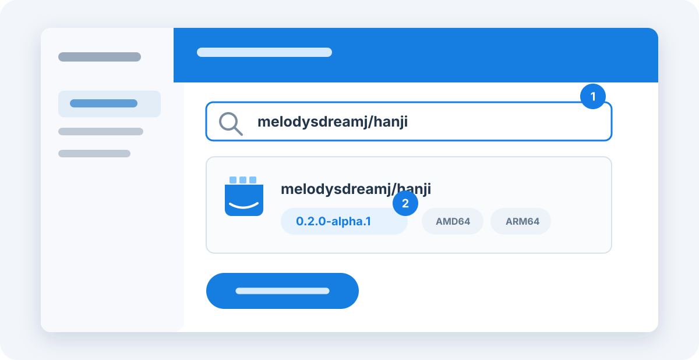
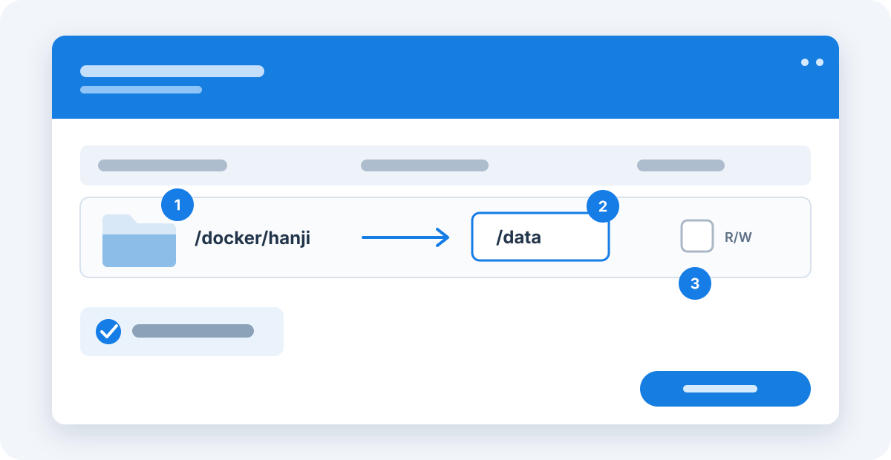

# Deployment

Hanji deploys as an EdgeBase app: the backend serves both the API and the
built SPA from one origin. Build the SPA first (`npm --prefix web run build`),
then use the EdgeBase deploy targets below.

## Two Docker installation paths

For the end-user Docker Desktop and command-line walkthrough, including
backups and updates, start with [Docker quick start](docker.md). The sections
below document the underlying deployment contract and advanced paths.

### Registry image (recommended for end users and NAS)

The release image is published to Docker Hub as `melodysdreamj/hanji` and to
GHCR as `ghcr.io/melodysdreamj/hanji`. The normal Docker/NAS install is:

```bash
HANJI_IMAGE=melodysdreamj/hanji:0.2.0-alpha
HANJI_MEMORY_LIMIT="$(
  docker run --rm --entrypoint node "$HANJI_IMAGE" \
    /usr/local/bin/hanji-memory-limit.mjs
)"
printf 'Hanji memory limit: %s\n' "$HANJI_MEMORY_LIMIT"
docker run -d \
  --name hanji \
  --restart unless-stopped \
  --log-driver local \
  --log-opt max-size=10m \
  --log-opt max-file=3 \
  --memory "$HANJI_MEMORY_LIMIT" \
  --memory-swap "$HANJI_MEMORY_LIMIT" \
  -p 127.0.0.1:8787:8787 \
  "$HANJI_IMAGE"
```

Then open `http://localhost:8787` and create the first server administrator in
the browser. There is no certificate warning, terminal setup code, or required
environment file. The image declares port `8787` and a `/data` volume, so
Docker automatically creates an anonymous persistent volume even when no
volume is selected in Docker Desktop or Synology. Publishing a host port is
still required for this direct-local path; bind it to loopback as above instead
of exposing it to the LAN.

The command selects Docker's `local` logging driver and retains at most three
10 MB stdout/stderr segments. The image cannot impose a host logging driver by
itself. These options are fixed when the container is created, so an older
container must be recreated—not merely restarted—to adopt the bound. Verify it
with:

```bash
docker inspect --format '{{json .HostConfig.LogConfig}}' hanji
```

The image-owned helper selects `max(2 GiB, 50% of detected RAM)` on hosts with
at least 4 GiB: 4 GiB becomes `2048m`, and 16 GiB becomes `8192m`. It fails
safely when RAM cannot be detected and refuses automatic sizing on 2–3 GiB
hosts rather than starving DSM or another host service. Operators who have
confirmed host headroom may run the helper with
`HANJI_MEMORY_LIMIT=1536m` for the verified minimum tier, or with a larger
finite whole-MiB/GiB value to loosen the default. Its printed value is applied
equally to memory and memory-plus-swap, providing a finite cgroup boundary.
The signed EdgeBase gateway sheds new HTTP and WebSocket work with a retryable
429 response above its high watermark and reopens below its recovery watermark;
it does not alter the product-health JSON contract.

The anonymous volume survives container stop/start and restart, but its
generated name is harder to identify, back up, and intentionally reattach after
container replacement. For ongoing use, map a named volume with
`-v hanji-data:/data`, or map a dedicated host/NAS folder to container path
`/data` with read/write access. The image generates JWT, service,
import-encryption, and MCP OAuth secrets on first start and stores them under
`/data/.hanji/`; browser setup closes through durable database state rather
than a persisted terminal code.

**Publication status:** `0.2.0-alpha` is publicly pullable from Docker Hub and
GHCR as a multi-platform Linux AMD64/ARM64 image. Use the immutable version tag
for deployments; `alpha` follows the newest alpha, while `latest` is reserved
for a future stable release. Each new container release builds every platform
once, publishes the verified digests to both registries, and fails publication
if their anonymous manifests or final index digests differ.

### Source/custom build

Clone the repository and run:

```bash
bash scripts/selfhost-docker.sh up --build
```

This builds `hanji:latest` from the checked-out source, provisions HTTPS, starts
the same image contract, and prints the URL. Use this
path when changing Hanji, auditing the exact source, or testing an unreleased
revision. The repository build helper prepares the portable EdgeBase context
and adds Hanji's appliance entrypoint, so this path does not depend on an
unpublished local EdgeBase link. An existing legacy
`.edgebase/docker/hanji.env` remains supported;
the first start on the new image imports its cryptographic values into `/data`
before that env file is retired.

## First administrator on every runtime

Dev, Docker, and Cloudflare use the same browser form for the first server
administrator:

- **Dev**: `node scripts/setup-dev-env.mjs` writes runtime secrets only. Start
  the backend and enter the administrator name/email/password in the browser.
- **Docker**: open the fresh private instance and complete the form. No
  environment file or terminal setup code is required.
- **Cloudflare**: leave `HANJI_MASTER_EMAIL` and `HANJI_MASTER_PASSWORD` empty
  in `backend/.env.release`. `npm --prefix backend run deploy` generates a
  private `HANJI_BROWSER_SETUP_TOKEN`, syncs it as a Worker secret, and prints
  a fragment-only setup link after deploy. Open that link; an ordinary public
  visitor cannot claim the instance.
- **Portable pack**: enable `HANJI_BROWSER_SETUP=true` before the first start.
  Add a strong `HANJI_BROWSER_SETUP_TOKEN` when the runtime is already public.

The durable single-winner claim closes setup permanently. The old
`HANJI_MASTER_EMAIL` / `HANJI_MASTER_PASSWORD` pair remains supported only for
advanced noninteractive automation. Details:
[master-account.md](master-account.md).

## Ingress and HTTPS (Docker / pack)

### One source-build command

```bash
scripts/selfhost-docker.sh up
```

This builds the image, lets the image generate persistent secrets, issues an
HTTPS certificate (`mkcert`-trusted when available, otherwise a self-signed
pair persisted under `/data/.hanji/tls`),
runs the container over HTTPS, verifies that the persistence
volume has at least 512 MiB free, keeps sampling that same volume while the
runtime is live, waits for both runtime and product-database readiness, and
then prints the URL. The browser creates
the master account. A failed capacity, readiness, or bootstrap check removes the
unhealthy container but keeps its data volume. Re-running reuses the same
runtime secrets, certificate, and `hanji-data` volume. A mkcert private key
stays mode `0600` in both the gitignored host state and the Docker-managed
`hanji-certs` volume; the image-managed fallback key stays mode `0600` under
`/data`. Neither is made world-readable just to cross a host UID boundary.
Override with `--port N`,
`--email`, `--password`, or `--build` (force image rebuild). For a
proxy-terminated Linux/NAS setup, use
`--http --origin https://hanji.example.com`; this uses host networking, binds
the gateway to `127.0.0.1`, and trusts only that loopback proxy hop without a
proxy-trust environment flag. Docker bridge default-route addresses are never
treated as proxy identity. Manage the container with the `down`,
`logs`, and `status` subcommands. Advanced operators can change the free-space
floor with `HANJI_DOCKER_MIN_FREE_KB`; the runtime reopens admission after an
additional 128 MiB of headroom returns. New HTTP and WebSocket work receives a
retryable `507` while storage is below the floor, and health remains blocked;
a capacity-probe failure returns retryable `503`. Already admitted work drains,
and the reserve does not cap workspace or file content. Runtime ownership and
product-database health share a five-minute startup budget; set
`HANJI_STARTUP_TIMEOUT_MS` from `60000` through `1800000` milliseconds only for
storage that demonstrably needs a larger finite cold-open window. The launcher
and container use the same value. TLS helper state lives in the gitignored
`.edgebase/docker/`; product data and runtime secrets live in `/data`.
For a browser padlock with no warning, run `mkcert -install` once (it modifies
your OS trust store and asks for your password). The rest of this section
explains the underlying mechanism and the manual path.

### Default HTTP ingress and outbound HTTPS

The registry image listens on plain HTTP port `8787` by default. On a personal
computer, open it through `http://localhost:<published-port>` or
`http://127.0.0.1:<published-port>`. The released server permits its HttpOnly
browser session cookie on those explicit loopback hostnames only; non-loopback
plain-HTTP sign-in remains rejected.

This affects only inbound browser traffic. Notion import and other public API
requests still use HTTPS. The image includes the system public CA bundle so the
runtime can verify `https://api.notion.com/v1` without an operator-installed
certificate or environment variable.

On Synology or another Linux reverse proxy, use host networking and bind the
Hanji gateway to `127.0.0.1`. The appliance can then reach the private upstream
while a LAN or published-port client cannot. From that loopback peer, the
complete standard `X-Forwarded-For`, `X-Forwarded-Proto`, and
`X-Forwarded-Host` tuple is recognized and the browser receives a
`Secure; HttpOnly` session cookie. There is no second login, container TLS, or
proxy-trust environment flag. A Docker bridge default route is not trusted:
NAT can give the legitimate proxy and a direct client the same peer address.

### Optional direct container HTTPS

The source helper continues to use direct container HTTPS for its one-command
developer path. A custom operator can opt into the same mode:

```bash
LOCAL_PROTOCOL=https
```

With `LOCAL_PROTOCOL=https` and no certificate paths, the runtime generates a
self-signed certificate under `/data/.hanji/tls`; open
`https://localhost:8787`, trust it once, and
sign-in works (verified: `200 OK` with a `__Host-…-refresh; Secure` cookie).
For a stable, OS-trustable certificate that survives restarts, mount your own
and set `HTTPS_CERT_PATH` / `HTTPS_KEY_PATH` (e.g. under the `/data` volume).

For ordinary self-host app and password access, leave `HANJI_APP_ORIGIN` and
`HANJI_AUTH_ORIGIN` unset. This is the safe any-host default for a NAS name,
LAN address, reverse-proxy hostname, or loopback address; do not copy a
localhost value to another host. Account OAuth and emailed action links use
their separate exact public HTTPS `HANJI_AUTH_ORIGIN`. Passkeys use matching
`HANJI_PASSKEY_RP_ID` and `HANJI_PASSKEY_ORIGINS` and never derive WebAuthn
authority from the request Host. The source launcher prepares those advanced
auth values only in explicit proxy mode with
`--http --origin https://hanji.example.com`; its direct HTTPS mode injects no
origin binding.

Custom-domain publishing is also off by default. Set one dedicated real public
DNS target (for example,
`HANJI_CUSTOM_DOMAIN_CNAME_TARGET=sites.hanji.dev`, replaced with a hostname
you control) only when the deployment is ready to serve verified custom Host
routes. That single value enables the Custom domain field and is the exact
CNAME target shown to operators; it does not change ordinary `/site/<slug>`
publishing, `HANJI_APP_ORIGIN`, or `HANJI_AUTH_ORIGIN`.

## Synology Container Manager

Architecture alone does not establish Synology compatibility. Before
installing, select the exact NAS model in Synology's
[Container Manager release notes](https://www.synology.com/en-us/releaseNote/ContainerManager)
and confirm that Container Manager (or the legacy Docker package for an
explicitly documented legacy lane) is offered for that model and DSM version.
An `x86_64` or `aarch64` CPU does not compensate for a missing package,
unsupported DSM combination, kernel limitation, or absent cgroup controls.

“Published target” below describes an OCI image platform. “Physically
verified” means one exact NAS/DSM/runtime combination was exercised.
“Simulator verified” covers a Linux VM profile, not Synology hardware.
“Best effort” is intentionally narrower than a general support promise.

<!-- synology-support-matrix:start -->
| Lane | Architecture | DSM and container runtime | Kernel / cgroup | Hardware tier | Evidence and support meaning |
| --- | --- | --- | --- | --- | --- |
<!-- synology-support-cell:physical-amd64-ds918plus -->
| Physical DS918+ legacy lane | `linux/amd64` (`x86_64`) | DSM 7.1-42962 Update 9; Docker package 20.10.3-1308 (Engine 20.10.3) | `4.4.180+` / `v1` | 16 GiB installed (15.48 GiB MemTotal); 1536 MiB and 8192 MiB verified | Physically verified for this exact configuration; best effort rather than a claim covering every DS918+ or DSM version. This kernel does not expose the Docker PID controller, so the physical lane records that limit as unsupported while both simulator lanes retain the 256-PID gate. |
<!-- synology-support-cell:simulator-amd64-colima -->
| Current AMD64 simulator | `linux/amd64` (`x86_64`) | DSM not applicable; Docker Engine 29.5.2 / Colima 0.10.3 | `6.8.0-117-generic` / `v2` | 4 vCPU / 7.75 GiB VM | Simulator verified; this proves the modern Linux/cgroup-v2 lane, not a Synology model. |
<!-- synology-support-cell:simulator-arm64-colima -->
| Current ARM64 simulator | `linux/arm64` (`aarch64`) | DSM not applicable; Docker Engine 29.5.2 / Colima 0.10.3 | `6.8.0-117-generic` / `v2` | 4 vCPU / 7.74 GiB native VM; container constrained to 1 CPU / 1536 MiB / 256 PIDs | Simulator verified on native Apple Silicon with the NAS latency profile and complete content-smoke matrix; this is not physical Synology evidence. |
<!-- synology-support-cell:physical-arm64-unattached -->
| Physical ARM64 Synology | `linux/arm64` (`aarch64`) | Exact model/DSM/package combination not observed | Not observed | Not observed | Best effort only: real ARM64 Synology hardware is not physically verified. |
<!-- synology-support-matrix:end -->

The DS918+ row records a real legacy-package observation, not a recommendation
to remain on DSM 7.1. Its two transient memory-tier probes used port 49163
sequentially, returned healthy JSON with zero restarts and no OOM, and restored
the existing container and package daemon exactly. The Project workflow below
applies only when the selected model and DSM expose Container Manager with
Project support. A legacy Docker UI without Project is not assumed to enforce
the same Compose, logging, memory, and restart policy.

Synology's documented single-container wizard does not expose a per-container
logging driver. Use **Container Manager → Project** so the same configuration
that starts Hanji also enforces bounded logs:

1. Confirm the exact model/DSM combination offers Container Manager with
   Project support, then confirm the NAS reports `x86_64` or `aarch64`.
   Published releases target `linux/amd64` and `linux/arm64`; older 32-bit ARM
   models are unsupported.
2. Create a dedicated data folder such as `/volume1/docker/hanji`. Replace
   `volume1` below if the folder is on another storage volume. Keep the folder
   private to Hanji and prepare it for runtime UID/GID `10001:10001` as
   described in
   [Prepare the data-folder identity and ACL](#prepare-the-data-folder-identity-and-acl).
3. Over SSH, pull the exact image and run its sizing helper before creating a
   project:

   ```bash
   HANJI_IMAGE=melodysdreamj/hanji:0.2.0-alpha
   docker pull "$HANJI_IMAGE"
   docker run --rm --entrypoint node "$HANJI_IMAGE" \
     /usr/local/bin/hanji-memory-limit.mjs
   ```

   The last stdout line is the Compose value. A 16 GiB NAS prints `8192m`
   (8 GiB); a 4 GiB NAS prints `2048m`. Automatic sizing rejects 2–3 GiB
   hosts. The supported minimum verification tier is an explicit
   `1536m` override only after you confirm DSM and other packages retain enough
   headroom:

   ```bash
   HANJI_MEMORY_LIMIT=1536m docker run --rm \
     --entrypoint node -e HANJI_MEMORY_LIMIT "$HANJI_IMAGE" \
     /usr/local/bin/hanji-memory-limit.mjs
   ```

4. In **Container Manager → Project**, create a project and paste this Compose
   configuration into its editor. The Project pulls the immutable Docker Hub
   image automatically. GHCR remains available by replacing the image with
   `ghcr.io/melodysdreamj/hanji:0.2.0-alpha`. Replace
   `REPLACE_WITH_HANJI_MEMORY_LIMIT` with the exact helper output before
   deployment; leaving the placeholder makes Compose fail rather than launching
   without a finite bound.

   ```yaml
   services:
     hanji:
      image: melodysdreamj/hanji:0.2.0-alpha
       container_name: hanji
       network_mode: host
       environment:
         HOST: 127.0.0.1
       volumes:
         - /volume1/docker/hanji:/data
       mem_limit: REPLACE_WITH_HANJI_MEMORY_LIMIT
       restart: unless-stopped
       logging:
         driver: local
         options:
           max-size: "10m"
           max-file: "3"
   ```

   Leave the image's `LOCAL_PROTOCOL=http` default and do not add a proxy-trust
   variable. Host networking plus `HOST=127.0.0.1` keeps Hanji on the NAS
   loopback port `8787`; do not add a bridge port mapping. After deployment,
   open the Project's Hanji container details and confirm its logging
   configuration, or run this over SSH:

   ```bash
   docker inspect --format '{{json .HostConfig.LogConfig}}' hanji
   ```

   It must report `local`, `max-size=10m`, and `max-file=3`. The container
   details must also report the exact helper-selected memory limit; do not
   leave memory unlimited because the ingress pressure controller requires a
   finite cgroup boundary. The observed 16 GiB physical tier must therefore
   report 8192 MiB for the capable-host run.
5. Before adding HTTPS, verify both
   `http://127.0.0.1:8787/__edgebase/health` and
   `http://127.0.0.1:8787/api/functions/health` from an NAS shell. Confirm
   `http://NAS-IP:8787` is unreachable from another machine.
6. Add a Synology Reverse Proxy rule with a valid HTTPS certificate. A
   representative rule is source
   `HTTPS hanji.example.com:25781` to destination
   `HTTP 127.0.0.1:8787`. Enable the rule's WebSocket preset and complete
   forwarded-header tuple.
   The source host may be `*` when that external port is dedicated to Hanji;
   use the real host name when multiple services share a port. Forward only
   the public HTTPS port through the router—never the private loopback upstream.
   For normal password login, no Hanji protocol, proxy-trust, certificate, or
   origin environment variable is required: the image recognizes Synology's
   complete standard HTTPS proxy tuple automatically. Public-origin/passkey variables
   are only needed when enabling passkeys or another origin-sensitive advanced
   feature on a custom hostname. Use `HANJI_AUTH_ORIGIN` for account OAuth and
   emailed auth actions; it is independent of custom-site routing.
7. Assign the public hostname's valid certificate to the reverse-proxy service.
   Leave HSTS off until the route and certificate are confirmed, then enable it
   if it matches the rest of the deployment's HTTPS policy.
8. Visit the Hanji URL and create the first administrator directly in the
   browser. No container-log code or environment file is required. Keep a fresh
   instance private until this step is complete because the first visitor can
   claim the administrator, as with a traditional wiki installer.

### Prepare the data-folder identity and ACL

The image runs Hanji as runtime UID/GID `10001:10001`. A Docker-managed named
volume inherits the image's prepared `/data` directory, but a Synology bind
mount keeps the NAS folder's POSIX owner and Synology ACL. Hanji tests that
identity's actual read, write, create, and delete access before startup and
does not change host ownership or ACLs.

Prepare a new, empty directory dedicated only to Hanji before its first start:

1. Stop Hanji before changing permissions. In an NAS shell, record the
   directory's current owner and mode with `stat`, and record or screenshot its
   current ACL in **File Station → Properties → Permission**. Back up any
   non-empty directory before changing its identity.
2. Set the POSIX owner of this one directory to `10001:10001`; do not apply a
   recursive command to its parent. In File Station, confirm no inherited
   **Deny** entry blocks that identity and that the effective ACL permits these
   operations: read, write, create, delete, and traverse for this directory and
   its Hanji-owned descendants. Synology documents that mapped-folder permissions must agree
   in both
   [Container Manager and File Station](https://kb.synology.com/en-sg/DSM/tutorial/Docker_container_cant_access_the_folder_or_file),
   and that a Deny ACL takes precedence over an Allow.
3. Start Hanji. If startup reports that `/data` cannot be used as UID/GID
   `10001:10001`, stop it and repair only the dedicated directory; the
   container deliberately leaves the NAS owner and ACL unchanged. Never run
   `chown -R`, `chmod -R`, or a recursive permission reset on
   `/volume1/docker` or another mixed-use shared folder.

`EDGEBASE_UID` and `EDGEBASE_GID` may be overridden together only when an
operator has provisioned a dedicated service identity whose numeric UID/GID
matches the complete existing data tree and its ACL. Do not use UID 0, an
administrator account, or a personal account. Changing the identity after
data has been written can strand files and is not an ownership migration.

For rollback, stop Hanji before changing permissions, restore the recorded
owner/mode and the recorded File Station ACL on the dedicated directory, then
restart the previous container configuration. If the directory was newly
created and remains empty, removing only that directory is also safe. Never
delete or recursively rewrite an existing Hanji data tree as a permission
repair.

### Synology setup wireframes

These generic wireframes deliberately avoid DSM language/version-specific
labels and real NAS/domain information. They illustrate the durable image,
volume, network, and reverse-proxy values already encoded by the recommended
Project configuration. A raw single-container wizard is not a complete
substitute unless the NAS daemon is independently configured with the same
bounded logging policy.

#### 0. Pull the versioned image



1. The Project pulls the exact repository `melodysdreamj/hanji`.
2. Keep the immutable version tag `0.2.0-alpha`. DSM automatically chooses
   AMD64 or ARM64 for the NAS. Do not use `latest` for this alpha release.

The Project creates the container with host networking, `HOST=127.0.0.1`, and
the bounded `local` log policy. No environment file, setup code, protocol, or
proxy-trust variable is required; leave the internal protocol as HTTP because
Synology terminates public HTTPS later.

#### 1. Persist `/data`



1. Select any dedicated NAS folder; `/volume1/docker/hanji` is only an example.
2. The container mount path is always `/data`.
3. Keep the mount read/write. The Project configuration uses this explicit
   bind mount instead of a harder-to-manage anonymous volume.

#### 2. Use the host loopback network boundary

1. Select host networking; leave the port-mapping table empty.
2. Add only `HOST=127.0.0.1`. Do not add `HANJI_TRUSTED_PROXY_CIDRS` or another
   proxy-trust override for this standard topology.
3. From another LAN machine, confirm `NAS-IP:8787` is closed. This negative
   check is part of the trust boundary, not an optional firewall hint.
4. Confirm the Project YAML still declares logging driver `local`,
   `max-size: "10m"`, and `max-file: "3"` before every recreate or image update.

#### 3. Terminate HTTPS at Synology

1. The source is the public hostname with HTTPS on `443` or a dedicated port
   such as `25781`.
2. The destination stays plain HTTP at `127.0.0.1:8787`.
3. Enable Synology's WebSocket preset/custom headers and ensure the request
   contains one value each for `X-Forwarded-For`, `X-Forwarded-Proto`, and
   `X-Forwarded-Host`. Reverse proxy is the
   routing mechanism; WebSocket support is an option inside that rule, not an
   alternative to it.

In current DSM versions, edit the same reverse-proxy rule, open **Custom
Header** (the label may be translated as **User-defined header**), choose
**Create → WebSocket**, and save. Prefer the preset over typing the values by
hand. DSM normally creates these two request headers:

```text
Upgrade     $http_upgrade
Connection  $connection_upgrade
```

Also verify the same rule supplies exactly one value for the authority tuple
(DSM variable names can differ by release):

```text
X-Forwarded-For    $proxy_add_x_forwarded_for
X-Forwarded-Proto  https
X-Forwarded-Host   $host
```

Missing, duplicated, comma-joined, or conflicting tuple members fail closed.
Do not copy forwarding headers received from the public client; the NAS proxy
must overwrite them with its own connection values.

Reload any already-open Hanji tabs after saving so they reconnect through the
new rule. Normal page loads and `/api/health` can succeed even when these
headers are missing; WebSocket forwarding is what enables realtime database
updates, presence, and collaboration.

To verify the public rule from a terminal, replace the example origin and run:

```bash
PUBLIC_ORIGIN='https://hanji.example.com:25781'
curl --http1.1 --max-time 4 -sS -D - -o /dev/null \
  -H 'Connection: Upgrade' \
  -H 'Upgrade: websocket' \
  -H 'Sec-WebSocket-Version: 13' \
  -H "Sec-WebSocket-Key: $(openssl rand -base64 16)" \
  "$PUBLIC_ORIGIN/api/db/subscribe?namespace=app&table=workspaces" || true
```

Success starts with `HTTP/1.1 101 Switching Protocols`. A curl timeout after
that `101` is expected: the WebSocket stayed open until the four-second test
limit. `400 Expected WebSocket upgrade` means the reverse proxy still stripped
the upgrade headers; reopen the rule and apply the WebSocket preset. This check
proves the realtime proxy path only, not unrelated HTTP mutation or application
save behavior.

If a router is involved in the illustrated `25781` setup, forward external
TCP `25781` to the NAS's TCP `25781`. Do not forward loopback port `8787`. The certificate
must match the public hostname; the port number does not change certificate
matching.

For updates, download the new image and recreate only the container with the
same `/data` mapping. Never delete that directory/volume during an update.
Back up `/data` as one unit; it now contains pages, databases, uploaded files,
runtime secrets, and the setup-completion state.

## Release environment gate

Cloudflare release deploys read `backend/.env.release`. In strict mode this
must be a regular file (not a symlink or directory) with mode `0600`, or `0400`
for an intentionally read-only secret file. Required assignments must be
declared in the file even when CI supplies their values as shell overrides;
this makes the file an auditable release manifest and ensures safe values
overwrite stale Worker secrets.

For the normal browser bootstrap, copy `.env.release.example`, fill the public
origin, cryptographic/mail/legal values, and leave the two `HANJI_MASTER_*`
assignments empty. The deploy command fills only the private browser setup
capability; it never invents administrator credentials. Re-running deploy
preserves the same capability until setup is completed, while the durable
server record remains the authority that prevents reopening setup.

The tracked Wrangler flags include both `nodejs_compat` and
`nodejs_compat_populate_process_env`; strict preflight refuses a config that
would compile successfully but hide release secrets from config-time
`process.env`.

The gate rejects development/test runtime overrides, mock mail endpoints,
action-URL overrides, enabled debug/proxy-trust flags, reserved or private
domains, non-canonical origins, reserved email domains, weak/reused secrets,
and incomplete JWT rotation pairs. The app origin and any configured passkey
origins must resolve only to public A/AAAA addresses. Notion API/OAuth and SSRF
resolver endpoints are pinned to their documented upstream values.
Development guest/auto-login flags, the rate-limit profile, and DNS checking
must be explicitly set to their safe production values. Sponsor delivery mode
must also be explicit (`exact upstream`, `bundled`, or `off`) so a stale remote
`off` secret cannot silently change the shipped banner/license behavior.
Optional authority and OAuth state remains explicit when disabled: extra-admin
and product-OAuth use the exact lowercase `off` sentinel, while JWT-rotation
and Notion-OAuth credentials stay empty. EdgeBase then overwrites retained
Worker secrets instead of silently inheriting an older deployment's authority.
Hosted proxy trust must remain explicitly disabled; only the Docker appliance
entrypoint enables its scoped reverse-proxy boundary.

Email REST credentials and passkey relying-party settings are also declared
explicitly, including as empty values when their feature is disabled. This
prevents an older remote secret from silently re-enabling either capability.
`HANJI_NOTION_IMPORT_JOB_RETENTION_DAYS` must be an integer from 1 through 365;
the documented release value and the runtime fail-safe default are 14 days.

Production browser builds use the page's own origin for `/api` and `/admin`.
Strict preflight rejects every `VITE_*` value in the release environment and
in Vite files loaded by production (`.env`, `.env.local`, `.env.production`,
and `.env.production.local`), so a stale developer endpoint cannot redirect a
published browser bundle to another backend.

Strict provenance also requires a clean public Git worktree and a full
`HANJI_BUILD_SHA` equal to that checkout's `HEAD`. Uncommitted public changes
therefore fail by design. The environment file's source URL must identify that
same full object ID in its path.

## Source and license links

Every Hanji screen includes a persistent source and license notice. The runtime
keeps upstream, revision-pinned fallbacks for local development and recovery,
but the strict release/deploy gate does not treat an implicit fallback as
release-ready. Every deployment must explicitly set all three values. A
qualifying stock build may point them at the reachable upstream revision; a
modified deployment must point them at the exact Corresponding Source and
matching license texts for the build it is running:

```bash
HANJI_BUILD_SHA=0123456789abcdef0123456789abcdef01234567
HANJI_SOURCE_URL=https://source.example/releases/0123456789abcdef0123456789abcdef01234567
HANJI_AGPL_LICENSE_URL=https://source.example/releases/0123456789abcdef0123456789abcdef01234567/LICENSE
HANJI_SPONSOR_EXCEPTION_URL=https://source.example/releases/0123456789abcdef0123456789abcdef01234567/LICENSE-EXCEPTION
```

The hostnames above are documentation placeholders and must be replaced.
Invalid, private, credential-bearing, or non-HTTPS values are never exposed to
the browser and fall back at runtime, but they fail the strict release gate.
That gate resolves every hostname, rejects private/special-use addresses and
unsafe redirects, then performs bounded `HEAD` and range `GET` requests. It
rejects stalled or empty bodies, duplicate final redirect destinations, and
license/exception responses that lack their expected AGPL/exception markers.
Run the offline structural check freely during development; run the strict
network check before a release or deploy:

```bash
npm --prefix backend run preflight:release
npm --prefix backend run preflight:release:strict
```

`npm --prefix backend run preflight:deploy` uses the same strict check before
calling EdgeBase deploy, so a production typo or a private/unpublished source
repository cannot silently advertise a dead legal link.
The production validator also rejects every active pre-Hanji environment
variable name, even when an equivalent `HANJI_*` value is present. Runtime
read compatibility remains available for upgrades, but a new release must use
only the canonical deployment namespace.
Distributors should also keep the bundled `LICENSE`, `LICENSE-EXCEPTION`, and
`SOURCE-OFFER` files with Docker or portable-pack artifacts. This is operational
guidance, not legal advice; the custom exception should be reviewed by counsel.

## Email on hosted Cloudflare Workers

The tracked Wrangler configuration declares the exact `EMAIL` Workers
`send_email` binding, and strict preflight accepts binding-only delivery only
when that static declaration is present and
`HANJI_CLOUDFLARE_EMAIL_BINDING=EMAIL`. A different binding name needs the
Cloudflare REST account/token pair instead. Local, Docker, and packed runtimes
always use REST delivery — see
[development.md](development.md#email-delivery).

That static proof does not prove the Cloudflare account is ready to deliver
mail. Before public release:

1. Use Cloudflare DNS and onboard the sender domain under Email Service → Email
   Sending; wait for its MX/SPF/DKIM/DMARC records to verify. See Cloudflare's
   [Email Sending setup](https://developers.cloudflare.com/email-service/get-started/send-emails/)
   and [domain verification](https://developers.cloudflare.com/email-service/configuration/domains/).
2. Confirm the account plan matches the audience. Cloudflare currently permits
   sends to verified destination addresses on all plans, while arbitrary
   recipients require Workers Paid; see the official
   [Email Service pricing](https://developers.cloudflare.com/email-service/platform/pricing/).
3. On the deployed release, request a password reset for a real external test
   mailbox, receive the message, open its same-origin fragment link, complete
   the reset, and verify the token cannot be reused. This live smoke is a
   release prerequisite: preflight proves only binding/config shape, not domain
   onboarding, plan entitlement, suppression state, or real deliverability.

## Deployment verification

To verify the deployable EdgeBase app surfaces without human visual review:

```bash
npm --prefix backend run verify:deployment
```

That rebuilds the SPA, verifies the local EdgeBase package links, checks the
EdgeBase app bundle, a temporary portable directory pack runtime, hosted
deploy dry-run bundle, Docker image/context, and a temporary Docker runtime
with SPA fallback routes for `/`, `/settings`, `/trash`, `/p/:id`,
`/database/:id`, `/workspace/:slug`, and `/share/:id`. If Docker is
unavailable, use `node scripts/deployment-verify.mjs --skip-docker` to verify
the pack runtime and hosted deploy dry-run output only.

## Tearing down Cloudflare resources

To remove every Cloudflare resource a deployment created, see
[cloudflare-teardown.md](cloudflare-teardown.md).
